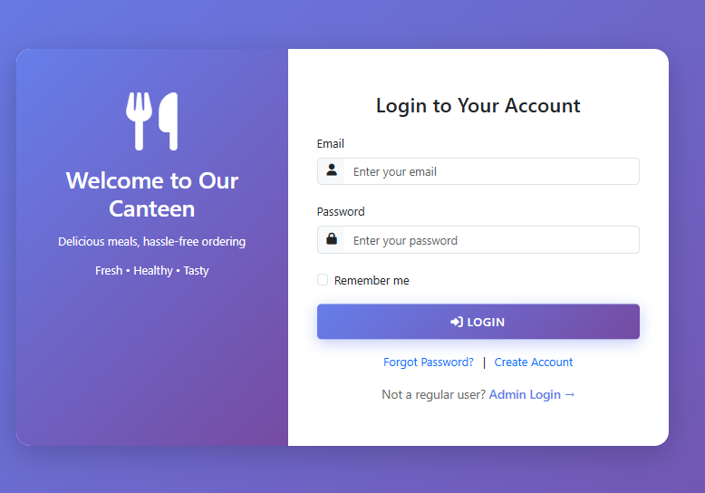
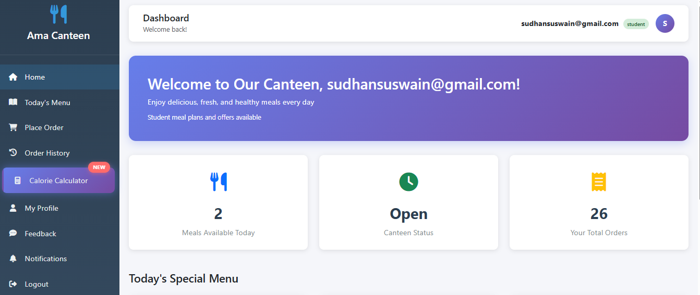
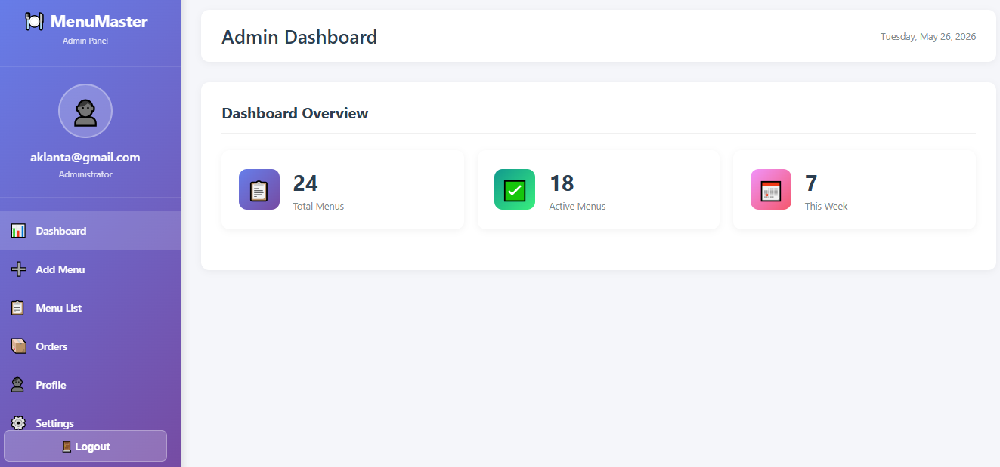
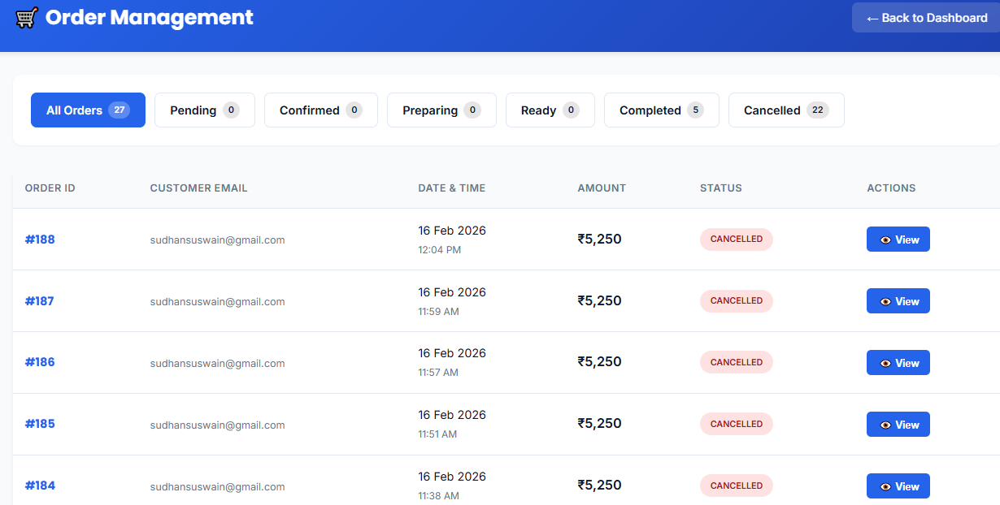
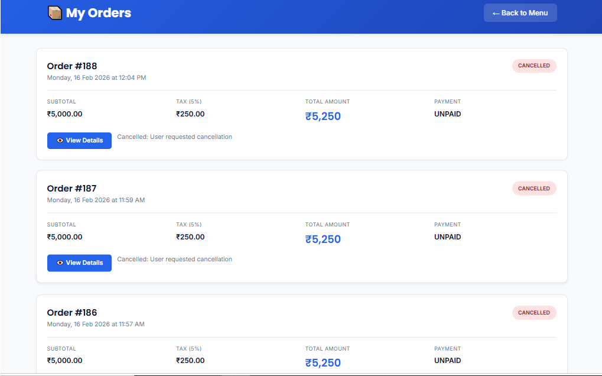
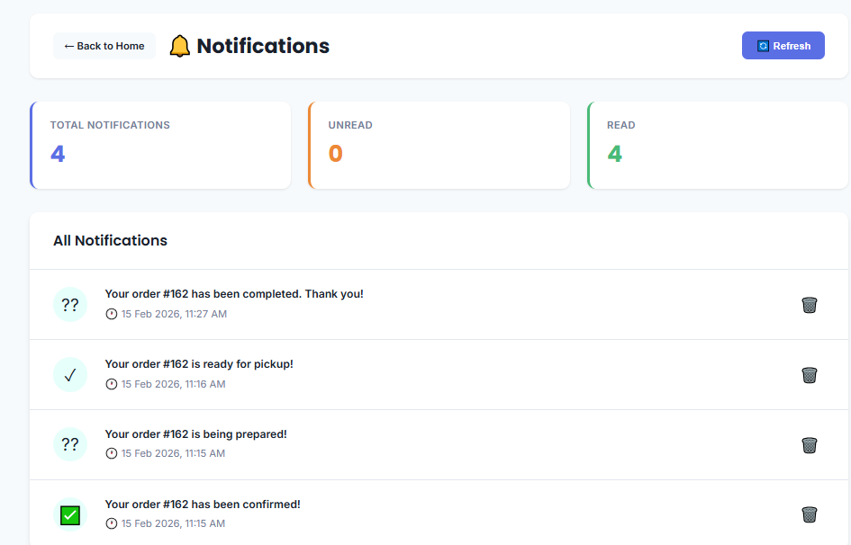
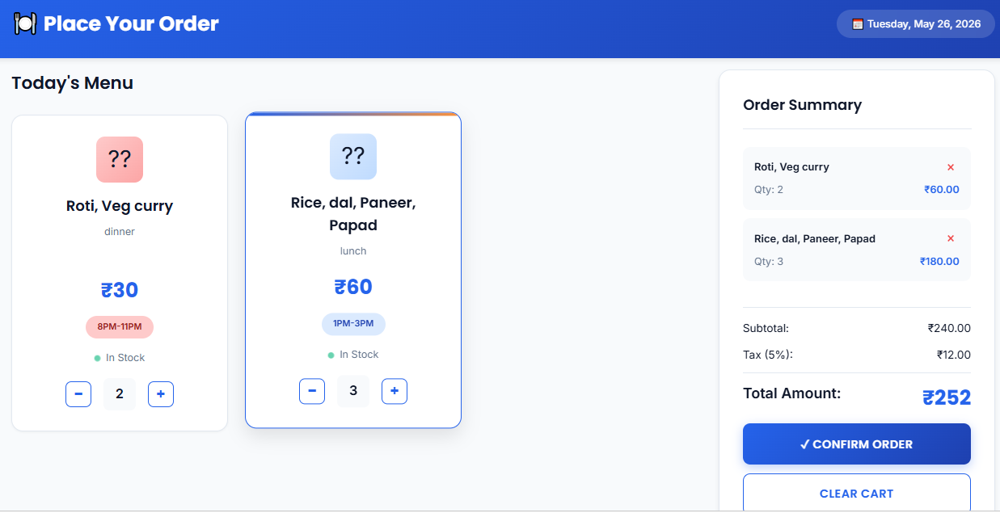
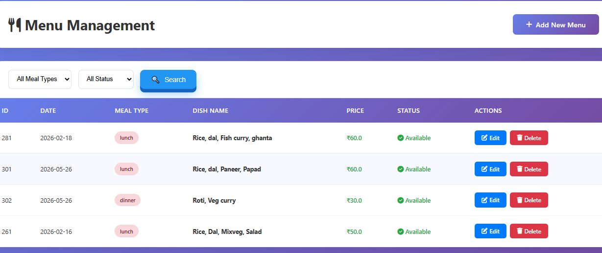

# Canteen Management System

A full-stack web application built with **Java, Servlet, JDBC, JSP, and Oracle DB** that digitises canteen operations for students and administrators.

---

## Features

### Student
- Register, login, and forgot/reset password
- View daily menu with item availability
- Place orders with quantity tracking
- Track real-time order status
- View complete order history

### Admin
- Add, edit, and toggle menu items (active/inactive) by date
- Filter menu by type and availability
- View all orders with full details
- Update order status and cancel orders

---

## Tech Stack

| Layer | Technology |
|-------|-----------|
| Backend | Java, Servlet, JDBC |
| Frontend | JSP, JavaScript, Bootstrap |
| Database | Oracle (SQL/PL/SQL) |
| Server | Apache Tomcat |
| Tools | IntelliJ IDEA, Git |

---

## Screenshots

### Login Page


### Student Dashboard


### Admin Dashboard


### Order Management


### Order istory


### Notifications


### Place Order


### Menu List



---

## Setup & Installation

### Prerequisites
- JDK 11 or above
- Apache Tomcat 9+
- Oracle Database
- IntelliJ IDEA or Eclipse

### Steps

1. Clone the repository
   ```bash
   git clone https://github.com/aklantaswain/canteen-management.git
   ```

2. Configure database — create a `db.properties` file in `src/main/resources/`:
   ```properties
   db.url=jdbc:oracle:thin:@localhost:1521:xe
   db.username=your_username
   db.password=your_password
   ```

3. Import the SQL schema
   ```sql
   -- Run the script in /database/schema.sql on your Oracle DB
   ```

4. Build the project with Maven
   ```bash
   mvn clean package
   ```

5. Deploy the generated `.war` file to Tomcat `webapps/` folder

6. Access at `http://localhost:8080/canteen`

---

## Project Structure

```
src/main/
├── java/
│   ├── controller/     # Servlet controllers
│   ├── dao/            # JDBC database access
│   ├── model/          # Entity classes
│   └── util/           # DB connection, helpers
├── webapp/
│   ├── WEB-INF/
│   ├── jsp/            # JSP view pages
│   └── css/js/         # Static assets
database/
└── schema.sql          # Oracle DB schema
```

---

## Author

**Aklanta Swain** — [LinkedIn](https://www.linkedin.com/in/aklanta-swain-a7b4342b4/) | [GitHub](https://github.com/Aklanta-07)
